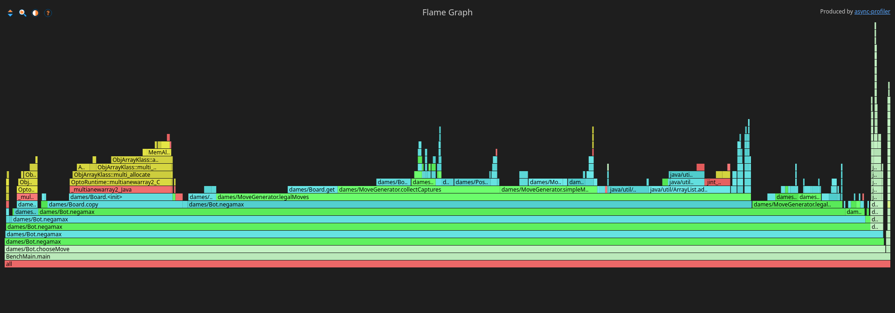

# jeux-de-damme

Jeu de dames internationales (10x10) en Java 21, en console, avec un bot (minimax) **volontairement non optimisé** :
il sert de point de départ pour mesurer puis améliorer les performances (voir « Optimisation »).

## Jouer

- Lancer : `mvn -q exec:java` — Tests : `mvn test`
- Saisie : `b4-c5` (déplacement), `c3-e5-g7` (rafle) ; `coups` liste les coups légaux, `q` quitte.
- Contre le bot : répondre `o` à « Jouer contre le bot ? », choisir sa couleur puis la profondeur de recherche.

Règles : prise obligatoire et majoritaire, prise arrière des pions, dames volantes, promotion uniquement si le coup s'achève sur la dernière ligne.

## Mesurer les performances

Un seul script mesure les trois chiffres principaux et écrit `resultats/<nom>.md` (≈ 3 minutes) :

| Mesure | Outil |
|---|---|
| Temps du bot | [hyperfine](https://github.com/sharkdp/hyperfine) |
| Mémoire allouée | [`bench/Bench.java`](bench/Bench.java) |
| Tenue du serveur sous charge | [Vegeta](https://github.com/tsenart/vegeta) sur [`Api`](src/main/java/dames/Api.java) (`GET /api/move`) |

```
python3 mesures.py avant    # avant optimisation -> resultats/avant.md
python3 mesures.py apres    # après optimisation -> resultats/apres.md
```

Prérequis (une fois) : `sudo dnf install hyperfine` et `go install github.com/tsenart/vegeta/v12@latest`.
Conditions : chargeur branché, navigateur fermé, ne rien lancer pendant la mesure (le script signale les conditions
douteuses par un ⚠). Après optimisation, les coups joués doivent rester **identiques** (ils sont notés dans le fichier).

### Où le temps passe (optionnel) : `./profile.sh <nom>`

Profil CPU et allocations avec [async-profiler](https://github.com/async-profiler/async-profiler), dans
`profiling/results/` : flamegraphs `<nom>-cpu.html` / `<nom>-alloc.html` (à ouvrir dans le navigateur, `Ctrl+F` cherche une
méthode) et résumés en pourcentages `<nom>-cpu.txt` / `<nom>-alloc.txt`. Installation (une fois) :
```
mkdir -p profiling && curl -sL https://github.com/async-profiler/async-profiler/releases/download/v4.5/async-profiler-4.5-linux-x64.tar.gz \
  | tar -xz -C profiling && mv profiling/async-profiler-4.5-linux-x64 profiling/async-profiler
```

## Résultats de la baseline (avant optimisation)

Mesurés le 24/09/2026 par `python3 mesures.py avant` sur le code non optimisé (secteur branché, Firefox fermé, machine
inactive à 96 %). Fichier complet : [`resultats/avant.md`](resultats/avant.md). Profils CPU et allocations :
[`resultats/profil-avant.md`](resultats/profil-avant.md).

### Banc d'essai
| | |
|---|---|
| CPU | Intel Core i7-1165G7 @ 2,8 GHz (jusqu'à 4,7 GHz), 4 cœurs / 8 threads |
| Caches | L1d 48 Ko et L1i 32 Ko par cœur, L2 1,25 Mo par cœur, L3 12 Mo partagé, lignes de 64 octets |
| RAM | 15 Gio |
| OS | Fedora Linux 42 |
| Runtime | OpenJDK 21.0.11, tas fixé à 1 Go pour la mesure du temps |

### Temps du bot (hyperfine : 3 exécutions de chauffe jetées, 15 mesurées ; 3 coups joués, profondeur 6)
| Moyenne | Médiane | Écart-type | Variance | Min | Max |
|---|---|---|---|---|---|
| **1,355 s** | 1,374 s | 0,043 s (3,2 %) | 0,00188 s² | 1,280 s | 1,421 s |

Lors d'un essai précédent, deux versions identiques ont donné 1,383 s et 1,445 s : la machine a un **plancher de bruit
d'environ 4 %**, et un gain inférieur à ~10 % ne serait pas crédible.

### Mémoire (octets alloués, mesure exacte)
| | Alloué |
|---|---|
| un appel de `legalMoves` | **4 992 octets** |
| une recherche `chooseMove` (profondeur 6) | **1 969,8 Mo** |

Les octets sont stables d'une mesure à l'autre (1 969,8 à 1 971,9 Mo), pas le temps par appel (0,80 à 0,99 µs) : pour le
temps, se fier à hyperfine. Ramasse-miettes (mesure à part) : 10 pauses, **9 ms** au total.

### Serveur sous charge (Vegeta, `GET /api/move`, profondeur 5, 15 s par débit)
| Requêtes/s envoyées | Requêtes/s servies | Succès | p50 | p99 |
|---|---|---|---|---|
| 10 | 10,0 | 100 % | 80 ms | 118 ms |
| 20 | 20,0 | 100 % | 75 ms | 123 ms |
| 30 | 29,8 | 100 % | 123 ms | 170 ms |
| 40 | 27,7 | 98 % | 6 813 ms | 10 008 ms |

- **jusqu'à 30 requêtes/s, le serveur suit** : tout est servi et p99 ≤ 170 ms ;
- **à 40 requêtes/s, il plafonne à ≈ 28 requêtes servies par seconde** : les requêtes en trop s'empilent et la latence
  médiane passe à 6,8 s. Le taux de succès (98 %) dépend de la durée du test : lors d'un essai plus long (20 s), seules
  39 % des requêtes répondaient avant le timeout de 10 s ;
- une seule passe par débit : les valeurs valent à ± 15 % près (p50 à 20 requêtes/s inférieur à celui de 10, par exemple).
  Hypothèse à vérifier pour la saturation : `Api` utilise un pool de threads non borné (`newCachedThreadPool`).

### Où passe le temps (profil CPU, 1 962 échantillons)


| Méthode | Part du CPU total |
|---|---|
| `Bot.chooseMove` (tout le bot) | 62,8 % |
| dont `MoveGenerator.legalMoves` | **47,2 %**, soit **75 % du temps du bot** |
| dont `Board.copy` | 11,6 % (`Board.<init>` : 9,1 %, l'allocation du tableau `Piece[10][10]`) |
| hors du projet (threads de la JVM : compilation JIT, GC) | 36,9 % |

Sous `legalMoves` : `collectCaptures` 14,5 % et `simpleMoves` 9,0 %. Petits utilitaires appelés partout dans le bot :
`Board.get` 8,8 % et `Position.plus` 4,9 %.

### Allocations (profil, ≈ 5,4 Go échantillonnés)
| Type d'objet | Part des octets |
|---|---|
| `Position` | **51,5 %** |
| `Object[]` | 15,0 % |
| `ArrayList` | 14,9 % |
| `Piece[]` | 10,4 % |
| autres | 8,2 % |

88,6 % des octets sont alloués sous `legalMoves` (dont 28,8 % par `Position.plus`) et 11,0 % sous `Board.copy`.

## Optimisation

**Méthode** : un seul changement à la fois. Après chacun, lancer `python3 mesures.py apres` : les coups sont-ils identiques ?
est-ce plus rapide ? On garde le changement s'il gagne, sinon on l'annule et on note pourquoi.

**Diagnostic de départ** (chiffres détaillés dans « Résultats de la baseline ») :
- le goulet est `MoveGenerator.legalMoves` : **75 % du temps du bot** ;
- son coût vient de la **création** de petits objets (≈ 5 Ko par appel), pas du ramasse-miettes : 10 pauses, 9 ms au total.

**Pistes** (à cocher au fur et à mesure) :

| Axe | Idée | Fait |
|---|---|---|
| Mémoire | jouer puis annuler le coup en place (`Board.apply`/`undo`) au lieu de copier tout le plateau à chaque noeud | ☑ |
| Mémoire | plateau en tableau d'entiers, plus d'objets `Position`/`Piece` du tout (reste : ils sont gardés pour l'instant) | ☐ |
| Arrêt précoce | élagage alpha-bêta : ne pas explorer les branches qui ne peuvent plus être meilleures | ☐ |
| Concurrence | un nombre fixe de threads (= cœurs physiques, ici 4) sur les coups de départ | ☐ |
| Cache | table de transposition : ne pas recalculer une position déjà vue | ☐ |

**Journal** — une ligne par essai, y compris ceux qui échouent :

| Essai | Changement | Moyenne | Gain vs baseline | Gardé ? |
|---|---|---|---|---|
| 0 | baseline (`git tag baseline`) | 1,383 s ± 0,068 | ×1,00 | — |
| 1 | `Board.apply`/`undo` en place au lieu de `copy()` (voir `dames.Bench`, pas encore mesuré via `./run_benchmarks.sh`) | `Bot.chooseMove` d=6 : 344 ms (593 ms avant) | ×1,72 | ☑ (mêmes 199 270 noeuds explorés et même coup choisi qu'avant : comportement inchangé) |
| 0 | baseline (avant optimisation) | 1,355 s ± 0,043 | ×1,00 | — |
