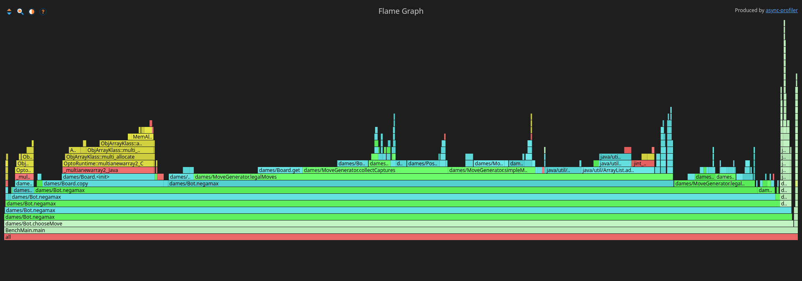

# jeux-de-damme

Jeu de dames internationales (10x10) en Java 21, en console, avec un bot (minimax) **volontairement non optimisé au départ** :
il sert de point de départ pour mesurer puis améliorer les performances (voir « Optimisation »).

## Jouer

- Lancer : `mvn -q exec:java` — Tests : `mvn test`
- Saisie : `b4-c5` (déplacement), `c3-e5-g7` (rafle) ; `coups` liste les coups légaux, `q` quitte.
- Contre le bot : répondre `o` à « Jouer contre le bot ? », choisir sa couleur puis la profondeur de recherche.

Règles : prise obligatoire et majoritaire, prise arrière des pions, dames volantes, promotion uniquement si le coup s'achève sur la dernière ligne.

## Mesurer les performances

Un seul script mesure les trois chiffres principaux et écrit `resultats/<nom>.md` (≈ 3 minutes) :

| Mesure | Outil |
|---|---|
| Temps du bot | [hyperfine](https://github.com/sharkdp/hyperfine) |
| Mémoire allouée | [`bench/Bench.java`](bench/Bench.java) |
| Tenue du serveur sous charge | [Vegeta](https://github.com/tsenart/vegeta) sur [`Api`](src/main/java/dames/Api.java) (`GET /api/move`) |

```
python3 mesures.py avant    # avant optimisation -> resultats/avant.md
python3 mesures.py apres    # après optimisation -> resultats/apres.md
```

Prérequis (une fois) : `sudo dnf install hyperfine` et `go install github.com/tsenart/vegeta/v12@latest`.
Conditions : chargeur branché, navigateur fermé, ne rien lancer pendant la mesure (le script signale les conditions
douteuses par un ⚠). Après optimisation, les coups joués doivent rester **identiques** (ils sont notés dans le fichier).

### Où le temps passe (optionnel) : `./profile.sh <nom>`

Profil CPU et allocations avec [async-profiler](https://github.com/async-profiler/async-profiler), dans
`profiling/results/` : flamegraphs `<nom>-cpu.html` / `<nom>-alloc.html` (à ouvrir dans le navigateur, `Ctrl+F` cherche une
méthode) et résumés en pourcentages `<nom>-cpu.txt` / `<nom>-alloc.txt`. Installation (une fois) :
```
mkdir -p profiling && curl -sL https://github.com/async-profiler/async-profiler/releases/download/v4.5/async-profiler-4.5-linux-x64.tar.gz \
  | tar -xz -C profiling && mv profiling/async-profiler-4.5-linux-x64 profiling/async-profiler
```

## Résultats de la baseline (avant optimisation)

Mesurés le 24/09/2026 par `python3 mesures.py avant` sur le code non optimisé (secteur branché, Firefox fermé, machine
inactive à 96 %). Fichier complet : [`resultats/avant.md`](resultats/avant.md). Profils CPU et allocations :
[`resultats/profil-avant.md`](resultats/profil-avant.md).

### Banc d'essai
| | |
|---|---|
| CPU | Intel Core i7-1165G7 @ 2,8 GHz (jusqu'à 4,7 GHz), 4 cœurs / 8 threads |
| Caches | L1d 48 Ko et L1i 32 Ko par cœur, L2 1,25 Mo par cœur, L3 12 Mo partagé, lignes de 64 octets |
| RAM | 15 Gio |
| OS | Fedora Linux 42 |
| Runtime | OpenJDK 21.0.11, tas fixé à 1 Go pour la mesure du temps |

### Temps du bot (hyperfine : 3 exécutions de chauffe jetées, 15 mesurées ; 3 coups joués, profondeur 6)
| Moyenne | Médiane | Écart-type | Variance | Min | Max |
|---|---|---|---|---|---|
| **1,355 s** | 1,374 s | 0,043 s (3,2 %) | 0,00188 s² | 1,280 s | 1,421 s |

Lors d'un essai précédent, deux versions identiques ont donné 1,383 s et 1,445 s : la machine a un **plancher de bruit
d'environ 4 %**, et un gain inférieur à ~10 % ne serait pas crédible.

### Mémoire (octets alloués, mesure exacte)
| | Alloué |
|---|---|
| un appel de `legalMoves` | **4 992 octets** |
| une recherche `chooseMove` (profondeur 6) | **1 969,8 Mo** |

Les octets sont stables d'une mesure à l'autre (1 969,8 à 1 971,9 Mo), pas le temps par appel (0,80 à 0,99 µs) : pour le
temps, se fier à hyperfine. Ramasse-miettes (mesure à part) : 10 pauses, **9 ms** au total.

### Serveur sous charge (Vegeta, `GET /api/move`, profondeur 5, 15 s par débit)
| Requêtes/s envoyées | Requêtes/s servies | Succès | p50 | p99 |
|---|---|---|---|---|
| 10 | 10,0 | 100 % | 80 ms | 118 ms |
| 20 | 20,0 | 100 % | 75 ms | 123 ms |
| 30 | 29,8 | 100 % | 123 ms | 170 ms |
| 40 | 27,7 | 98 % | 6 813 ms | 10 008 ms |

- **jusqu'à 30 requêtes/s, le serveur suit** : tout est servi et p99 ≤ 170 ms ;
- **à 40 requêtes/s, il plafonne à ≈ 28 requêtes servies par seconde** : les requêtes en trop s'empilent et la latence
  médiane passe à 6,8 s. Le taux de succès (98 %) dépend de la durée du test : lors d'un essai plus long (20 s), seules
  39 % des requêtes répondaient avant le timeout de 10 s ;
- une seule passe par débit : les valeurs valent à ± 15 % près (p50 à 20 requêtes/s inférieur à celui de 10, par exemple).
  Hypothèse à vérifier pour la saturation : `Api` utilise un pool de threads non borné (`newCachedThreadPool`).

### Où passe le temps (profil CPU, 1 962 échantillons)


| Méthode | Part du CPU total |
|---|---|
| `Bot.chooseMove` (tout le bot) | 62,8 % |
| dont `MoveGenerator.legalMoves` | **47,2 %**, soit **75 % du temps du bot** |
| dont `Board.copy` | 11,6 % (`Board.<init>` : 9,1 %, l'allocation du tableau `Piece[10][10]`) |
| hors du projet (threads de la JVM : compilation JIT, GC) | 36,9 % |

Sous `legalMoves` : `collectCaptures` 14,5 % et `simpleMoves` 9,0 %. Petits utilitaires appelés partout dans le bot :
`Board.get` 8,8 % et `Position.plus` 4,9 %.

### Allocations (profil, ≈ 5,4 Go échantillonnés)
| Type d'objet | Part des octets |
|---|---|
| `Position` | **51,5 %** |
| `Object[]` | 15,0 % |
| `ArrayList` | 14,9 % |
| `Piece[]` | 10,4 % |
| autres | 8,2 % |

88,6 % des octets sont alloués sous `legalMoves` (dont 28,8 % par `Position.plus`) et 11,0 % sous `Board.copy`.

## Optimisation

**Méthode** : un seul changement à la fois. Après chacun, lancer `python3 mesures.py apres` : les coups sont-ils identiques ?
est-ce plus rapide ? On garde le changement s'il gagne, sinon on l'annule et on note pourquoi.

**Diagnostic de départ** (chiffres détaillés dans « Résultats de la baseline ») :
- le goulet est `MoveGenerator.legalMoves` : **75 % du temps du bot** ;
- son coût vient de la **création** de petits objets (≈ 5 Ko par appel), pas du ramasse-miettes : 10 pauses, 9 ms au total.

**Pistes** (à cocher au fur et à mesure) :

| Axe | Idée | Fait |
|---|---|---|
| Mémoire | jouer puis annuler le coup au lieu de copier tout le plateau (`Board.apply`/`undo`), tableau plat | ☑ |
| Mémoire | réutiliser les listes de travail de `legalMoves` au lieu d'en créer pour chaque pièce | ☑ |
| Mémoire | supprimer les objets `Position`/`Piece` restants (les remplacer par des entiers) | ☐ |
| Arrêt précoce | élagage alpha-bêta : ne pas explorer les branches qui ne peuvent plus être meilleures | ☑ |
| Concurrence | un nombre fixe de threads sur les coups de départ | ✗ échec (voir journal) |
| Cache | table de transposition : ne pas recalculer une position déjà vue | ☑ |

**Journal** — une ligne par essai, y compris ceux qui échouent. Chaque gain est celui **de l'étape**, comparé à l'état
juste avant, mesuré dans la même session :

| Essai | Changement | Mesure | Gain de l'étape | Gardé ? |
|---|---|---|---|---|
| 0 | baseline (version de départ) | 1,355 s ± 0,043 (profondeur 6) | — | — |
| 1 | Mémoire : `Board.apply`/`undo` au lieu de copier le plateau, tableau plat, moins d'objets `Position` | 1,284 s ± 0,040, contre 1,508 s ± 0,050 pour la baseline de la même session (profondeur 6) | ×1,17 | oui |
| 2 | Élagage alpha-bêta | 0,137 s ± 0,015, contre 1,355 s (profondeur 6, mesuré seul) | **×9,9** | oui |
| 3 | Pool de threads sur les coups de départ | 1,305 s ± 0,072, contre 1,514 s (profondeur 6), mais 3,5× plus de CPU | ×1,16 | non : échec (branche `concurrence`) |
| 4 | Cache : table de transposition | 0,589 s ± 0,017, contre 1,099 s (profondeur 10, sur mémoire + alpha-bêta) | **×1,87** | oui |
| 5 | Mémoire (zéro-allocation) : listes de travail de `legalMoves` réutilisées | 0,508 s ± 0,017, contre 0,579 s ± 0,020 (profondeur 10, sur mémoire + alpha-bêta + cache) | ×1,14 | oui |
| **6** | **Version finale : les optimisations gardées (1, 2, 4, 5) ensemble** | **0,108 s ± 0,006, contre 1,317 s** (profondeur 6, baseline mesurée dans la même session) ; **0,174 s contre 37,8 s à profondeur 8** | **×12 (profondeur 6), ×217 (profondeur 8)** | oui |

Les lignes 1 à 3 sont mesurées à profondeur 6 et les lignes 4 et 5 à profondeur 10 : à profondeur 6, le gain du cache disparaît
dans le temps de démarrage de la JVM. La ligne 6 est le bilan de toutes les optimisations gardées ensemble : voir la
section « Synthèse finale » ci-dessous.

### Comparaison avant / après l'élagage alpha-bêta

Mesures officielles du 24/09/2026, même script, mêmes conditions (secteur branché, Firefox fermé) :
[`resultats/avant.md`](resultats/avant.md) et [`resultats/apres.md`](resultats/apres.md).

| Mesure | Avant | Après | Gain |
|---|---|---|---|
| Temps complet du bot (hyperfine, profondeur 6, 3 coups) | 1,355 s ± 0,043 | **0,137 s ± 0,015** | **×9,9** |
| Une recherche à profondeur 6 (JVM chauffée) | 403 ms | **11 ms** | **×37** |
| Mémoire allouée par recherche | 1 969,8 Mo | **27,6 Mo** | **÷71** |
| Mémoire allouée par appel de `legalMoves` | 4 992 octets | 4 992 octets | inchangé |
| Serveur à 10 req/s : p50 / p99 | 80 / 118 ms | 8 / 11 ms | ×10 / ×11 |
| Serveur à 20 req/s : p50 / p99 | 75 / 123 ms | 8 / 51 ms | ×9 / ×2,4 |
| Serveur à 30 req/s : p50 / p99 | 123 / 170 ms | 26 / 51 ms | ×4,7 / ×3,3 |
| Serveur à 40 req/s : requêtes servies | 27,7 par s (98 % de succès) | **40,0 par s (100 %)** | plus de saturation |
| Serveur à 40 req/s : p50 / p99 | 6 813 / 10 008 ms | **48 / 52 ms** | ×142 / au moins ×192 |

- **Le bot joue exactement les mêmes coups** : `b4-a5 a7-b6 d4-c5`. Vérifié en plus sur 9 000 positions (parties
  aléatoires, profondeurs 1 à 5) contre le bot d'origine : aucun coup différent ;
- **pourquoi ×37 sur une recherche mais ×10 sur le temps complet** : le processus complet démarre une JVM à froid.
  Environ 35 ms sont du démarrage (mesuré) et le reste du calcul avant que le compilateur JIT ait optimisé le code ;
  la ligne « une recherche » est mesurée JVM chauffée ;
- **pourquoi la mémoire baisse de ÷71** : l'élagage explore beaucoup moins de positions. Le coût *par position* n'a pas
  changé (`legalMoves` alloue toujours 4 992 octets par appel) : c'est la prochaine cible (axe Mémoire) ;
- **le serveur ne sature plus à 40 req/s** (p99 52 ms au lieu de 10 s, le timeout). Sa nouvelle limite n'est pas atteinte
  dans ce test (débits ≤ 40), et la latence médiane monte avec le débit (8 → 48 ms) : ne pas en déduire une capacité
  maximale. À 40 req/s, la latence « avant » est plafonnée par le timeout de 10 s, donc le vrai gain est plus grand ;
- **bruit** : l'écart-type relatif est de 11 % sur 0,137 s (durée courte), mais un gain ×10 le dépasse très largement ;
  une seule passe Vegeta par débit, soit ± 15 % de précision.

### Comparaison avant / après le cache (table de transposition)

**Le principe, en clair.** Pour choisir un coup, le bot explore un arbre de coups possibles. Or une même position peut
être atteinte par plusieurs chemins (jouer A puis B donne la même position que B puis A). Sans cache, le bot la
recalcule à chaque fois. Le cache retient le score de chaque position déjà évaluée pour ne le calculer qu'une fois.

**Comment ça marche.**
- une position est identifiée par une **empreinte de 64 bits** (technique de Zobrist : chaque couple case/pièce a une clé
  aléatoire, l'empreinte est le XOR des clés des pièces présentes, plus un bit pour le joueur qui a le trait) ;
- la table est un tableau de taille fixe, créé une seule fois par `Bot` : elle ne crée aucun objet pendant la recherche ;
- chaque entrée garde l'empreinte, le score, la **profondeur restante** et le type du score. Une entrée n'est réutilisée
  que pour la même profondeur restante, sinon le résultat pourrait changer ;
- l'élagage alpha-bêta ne calcule pas toujours une valeur exacte : quand il coupe une branche, il obtient seulement une
  **borne** (« au moins X » ou « au plus X »). Le cache mémorise donc aussi ces bornes.

**Pourquoi ce choix : on a mesuré avant de coder.** À profondeur 8, **57 % à 75 % des positions visitées étaient des
doublons** (mêmes pièces, même joueur, même profondeur restante). Hypothèse : au mieux ×2,3 à ×4 sur le nombre de positions
calculées. Deux versions ont été essayées (essai préliminaire, indicatif) :

| Version du cache | Lignes de `Bot.java` | Gain sur le temps complet (profondeur 10) |
|---|---|---|
| **complet : valeurs exactes et bornes** | 128 (contre 71 sans cache) | **×1,8** |
| simplifié : valeurs exactes seulement | 118 | ×1,3 |

La version simplifiée économise 10 lignes mais perd plus de la moitié du gain : on a gardé la version complète, dont le code
supplémentaire est justifié par la mesure.

**Résultats officiels** (26/09/2026). Les deux versions sont mesurées à la suite, dans la même session, à profondeur 10,
secteur branché, Firefox fermé, sans avertissement du script. Détail : [`resultats/cache.md`](resultats/cache.md).

| Mesure | Avant (sans cache) | Après (avec cache) | Gain |
|---|---|---|---|
| Temps complet du bot (hyperfine, 15 mesures, profondeur 10, 3 coups) | 1,099 s ± 0,052 | **0,589 s ± 0,017** | **×1,87** |
| Une recherche à profondeur 10 (JVM chauffée, cache vide au départ) | 282 ms | **99 ms** | **×2,85** |
| Mémoire allouée par recherche | 1 460,8 Mo | **392,7 Mo** | **÷3,7** (−73 %) |
| CPU total consommé (user + system) | 1,79 s | 1,27 s | −29 % |
| Mémoire allouée par appel de `legalMoves` | 3 072 octets | 3 072 octets | inchangé |
| Serveur à 40 req/s (profondeur 5) : requêtes servies | 39,9 /s (100 %) | 39,9 /s (100 %) | identique |
| Serveur à 40 req/s : latence médiane / p99 | 46 / 49 ms | 24 / 49 ms | ×1,9 / inchangé |

**Comment lire ces chiffres.**
- **Le bot joue exactement les mêmes coups** : `b4-a5 a7-b6 d4-c5`. Vérifié en plus sur 9 000 positions contre le bot
  d'origine (parties aléatoires, profondeurs 1 à 5), en réutilisant le même cache entre des positions différentes, ce qui
  est un test sévère ;
- **pourquoi la profondeur 10** : à profondeur 6, le temps total est dominé par le démarrage de la JVM (≈ 35 ms) et le gain
  disparaît. Plus la recherche est profonde, plus il y a de doublons, donc plus le cache gagne (sur une recherche : ×1,4 à
  profondeur 6, ×2,3 à profondeur 8, ×3 à profondeur 10, mesures préliminaires) ;
- **×1,87 sur le temps complet mais ×2,85 sur une recherche** : le temps complet contient le démarrage de la JVM et sa
  compilation à chaud, que le cache n'accélère pas. La recherche seule montre le gain de l'algorithme ;
- **la mémoire baisse de 73 %** parce que le bot calcule moins de positions. Le coût *par position* ne change pas
  (`legalMoves` alloue toujours 3 072 octets par appel) ;
- **le cache ne ralentit pas le serveur** : l'`Api` crée un `Bot` par requête, donc une table (≈ 150 Ko à profondeur 5),
  et le débit servi reste identique. Une seule passe à un seul débit : résultats à ± 15 % près ;
- **coût en code** : +57 lignes dans `Bot.java` (71 → 128) ;
- **limite** : deux positions différentes pourraient avoir la même empreinte (probabilité très faible avec 64 bits). Le bot
  utiliserait alors une mauvaise valeur sans le savoir. Ce n'est pas arrivé (coups identiques sur 9 000 positions), mais
  c'est théoriquement possible ;
- pour que la mesure de mémoire reste honnête, `bench/Bench.java` crée un `Bot` neuf (donc un cache vide) à chaque recherche
  mesurée.

### Comparaison avant / après les listes de travail réutilisées

**Le principe, en clair.** Pour lister les coups d'une position, `legalMoves` examine chaque pièce du joueur, et pour
chacune il **créait à chaque fois de nouvelles listes** (le chemin de la pièce, les pièces prises, ses coups simples), qui
étaient jetées juste après. Avec 20 pièces, cela fait des dizaines de petits objets créés puis détruits **à chaque
position explorée**. Désormais, `legalMoves` crée ces listes **une seule fois** au début, et les vide et les réutilise pour
chaque pièce.

**Avant / après, sur le code.**
- avant : `List<Position> path = new ArrayList<>(List.of(pos));` et `new ArrayList<>()` **pour chaque pièce**, et
  `simpleMoves` qui construisait puis renvoyait sa propre liste, recopiée ensuite avec `addAll` ;
- après : `path` et `captured` créées une fois hors de la boucle, `path.clear()` avant chaque pièce, et `simpleMoves` qui
  ajoute directement ses coups dans la liste finale. Le changement fait 7 lignes ajoutées et 6 retirées, dans un seul fichier.

**Pourquoi ce choix : le profil.** Sur le code après l'alpha-bêta et la mémoire (profondeur 10), `legalMoves` représentait
**91 % du temps du bot** et **99,3 % des octets alloués**. Dans ces allocations, les listes (`ArrayList`, tableaux
`Object[]`, `List.of`) pesaient **46 %** des octets. Hypothèse de départ : réutiliser ces listes supprime une grande
partie de ces allocations. Une première estimation, faite en comptant les listes créées, annonçait −60 % ; un prototype
mesuré a donné **−35 %**, et c'est ce que la mesure officielle confirme.

**Résultats officiels** (26/09/2026). Les deux versions sont mesurées à la suite, dans la même session, à profondeur 10,
secteur branché, Firefox fermé, sans avertissement du script. Détail : [`resultats/listes.md`](resultats/listes.md).

| Mesure | Avant | Après | Gain |
|---|---|---|---|
| Temps complet du bot (hyperfine, 15 mesures, profondeur 10, 3 coups) | 0,579 s ± 0,020 | **0,508 s ± 0,017** | **×1,14** (12 % de mieux) |
| Mémoire allouée par appel de `legalMoves` | 3 072 octets | **2 008 octets** | −35 % |
| Mémoire allouée par recherche | 392,7 Mo | **253,0 Mo** | −36 % |
| Une recherche à profondeur 10 (JVM chauffée) | 87 ms | 90 ms | pas de différence mesurable |
| CPU total consommé (user + system) | 1,217 s | 1,203 s | inchangé |
| Serveur à 40 req/s (profondeur 5) : requêtes servies | 39,9 /s (100 %) | 39,9 /s (100 %) | identique |
| Serveur à 40 req/s : latence médiane / p99 | 36 / 49 ms | 23 / 48 ms | ×1,6 / inchangé |

**Comment lire ces chiffres, honnêtement.**
- **Le bot joue exactement les mêmes coups** : `b4-a5 a7-b6 d4-c5`. Vérifié en plus sur 9 000 positions contre le bot
  d'origine (parties aléatoires, profondeurs 1 à 5) ;
- **le gain de temps est réel mais modeste** : ×1,14, juste au-dessus du seuil de crédibilité de 10 % fixé dans
  `constitution.md`. L'écart entre les deux moyennes vaut 10 fois l'erreur de mesure, donc il n'est pas dû au hasard ;
- **le gain de mémoire est net** (−35 %), mais **il ne se voit que sur le temps complet, pas sur une recherche JVM
  chauffée** (87 ms contre 90 ms). Le temps complet contient la phase de démarrage, où le ramasse-miettes travaille le plus :
  c'est là que créer moins d'objets aide. Sur une JVM déjà chauffée, le compilateur supprime déjà une partie de ces objets,
  donc le gain de temps disparaît ;
- **le CPU total ne baisse pas** (1,217 s contre 1,203 s) : le temps mural diminue parce que le travail du thread principal
  diminue, pas parce que la machine travaille moins ;
- **le serveur** : même débit servi, latence médiane de 36 à 23 ms. Une seule passe à un seul débit, résultats à ± 25 %
  près (la même version avait donné 46 ms lors d'une autre mesure) : à ne pas sur-interpréter ;
- **les gains ne s'additionnent pas** : ce gain est mesuré *par-dessus* le cache, qui a déjà supprimé beaucoup d'appels à
  `legalMoves`. Le même changement donnait ×1,15 avant le cache.

### Synthèse finale : baseline contre version finale

**Ce que compare ce tableau.** Le code de départ contre la version actuelle de `main` : mémoire, élagage alpha-bêta, cache et
listes réutilisées, ensemble. La concurrence, en échec, n'en fait pas partie. Les deux versions sont mesurées **à la suite,
dans la même session** (26/09/2026), avec `python3 mesures.py`, secteur branché, Firefox fermé, sans avertissement du script.
Détail : [`resultats/final.md`](resultats/final.md).

| Mesure | Baseline | Version finale | Gain |
|---|---|---|---|
| Temps complet du bot (hyperfine, 15 mesures, profondeur 6, 3 coups) | 1,317 s ± 0,042 | **0,108 s ± 0,006** | **×12,2** |
| **Temps complet à profondeur 8** (baseline : 1 mesure) | **37,8 s** | **0,174 s ± 0,012** | **×217** |
| CPU total consommé (user + system, profondeur 6) | 1,95 s | 0,25 s | ÷7,8 |
| Une recherche à profondeur 6 (JVM chauffée) | 403 ms | **9 ms** | ≈ **×45** |
| Mémoire allouée par recherche (profondeur 6) | 1 969,8 Mo | **6,9 Mo** | **÷285** |
| Mémoire allouée par appel de `legalMoves` | 4 992 octets | 2 008 octets | −60 % |
| Serveur à 10 req/s : latence médiane / p99 | 98 / 111 ms | 5 / 8 ms | ×20 / ×14 |
| Serveur à 20 req/s : latence médiane / p99 | 64 / 115 ms | 4 / 8 ms | ×16 / ×14 |
| Serveur à 30 req/s : latence médiane / p99 | 113 / 155 ms | 23 / 48 ms | ×4,9 / ×3,2 |
| Serveur à 40 req/s : requêtes servies (succès) | 26,7 /s (95 %) | **39,9 /s (100 %)** | plus de saturation |
| Serveur à 40 req/s : latence médiane / p99 | 7 088 / 10 010 ms | **23 / 48 ms** | ×308 / au moins ×208 |

**Comment lire ces chiffres.**
- **Le bot joue exactement les mêmes coups** dans les deux versions : `b4-a5 a7-b6 d4-c5`. À chaque optimisation, on a aussi
  comparé ses choix à ceux du bot d'origine sur 9 000 positions (parties aléatoires, profondeurs 1 à 5) : aucun coup
  différent ;
- **pourquoi ×12 à profondeur 6 mais ×217 à profondeur 8** : à profondeur 6, la version finale ne prend plus que 0,108 s,
  dont environ 35 ms sont le démarrage de la JVM (mesuré), qui ne se réduit pas. Plus la recherche est profonde, plus l'écart
  se creuse, parce que l'élagage et le cache réduisent le nombre de positions explorées de façon exponentielle. À
  profondeur 10, la baseline n'est plus mesurable en un temps raisonnable, alors que la version finale y répond en ≈ 0,5 s ;
- **le levier principal est l'algorithme, pas la micro-optimisation** : l'alpha-bêta (×9,9 à lui seul) et le cache (×1,87)
  pèsent bien plus que la mémoire (×1,17) et les listes réutilisées (×1,14). Réduire le *nombre* de positions calculées
  rapporte plus que réduire le *coût* de chacune ;
- **les gains ne se multiplient pas simplement** : le produit des gains du journal (≈ ×25) ne correspond ni au ×12 de la
  profondeur 6 (plancher du démarrage de la JVM) ni au ×217 de la profondeur 8, car chaque gain a été mesuré à une profondeur
  et sur un état différents, et l'un réduit la part de l'autre (le cache supprime des appels à `legalMoves`, donc le gain des
  listes s'en trouve diminué) ;
- **le serveur** ne sature plus : à 40 req/s, il sert toutes les requêtes (39,9 /s) avec une latence médiane de 23 ms, là où la
  baseline plafonnait à 26,7 /s avec 7 s de latence. Une seule passe par débit : résultats à ± 15 % près ;
- **la baseline de cette session** (1,317 s) est proche de celle du début (1,355 s) : la machine a peu dérivé ;
- **limites** : à profondeur 8, la baseline n'a été mesurée qu'une fois (l'écart est tel que le bruit n'y change rien) ; la
  concurrence, essayée puis abandonnée, n'est pas dans cette version.
