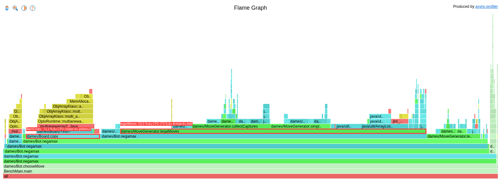
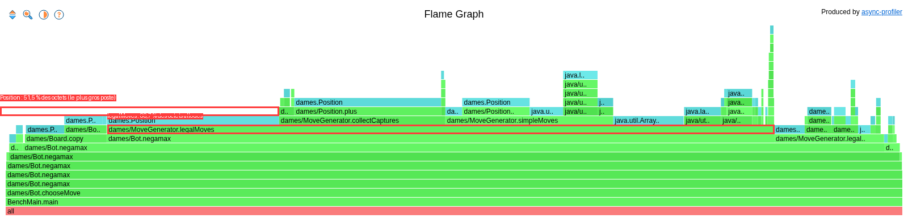

# Audit de performance : pourquoi on optimise, et ce qu'on a fait

Ce document explique la démarche : le problème mesuré sur la version de départ, puis chaque solution testée et
pourquoi. Les chiffres viennent de mesures réelles (`python3 mesures.py` et `./profile.sh`).
Les commandes pour rejouer ces mesures sont dans le [README](README.md).

État actuel : toutes les optimisations sont présentes sur la `main`, sauf la concurrence qui est un échec documenté et jamais fusionné.
La dernière section compare la version de départ (avant optimisation) à la version finale ( avec toutes les optimisations). 

## 1. Le problème : pourquoi optimiser

Le jeu et le bot sont volontairement écrits sans souci de performance, pour servir de point de départ mesurable.
Mesuré par le script  `python3 mesures.py avant` sur le code non optimisé (secteur branché,
Firefox fermé, machine inactive à 96 %). Fichier complet : [`resultats/avant.md`](resultats/avant.md). Profils CPU et
allocations : [`resultats/profil-avant.md`](resultats/profil-avant.md).

### Banc d'essai
| | |
|---|---|
| CPU | Intel Core i7-1165G7 @ 2,8 GHz (jusqu'à 4,7 GHz), 4 cœurs / 8 threads |
| Caches | L1d 48 Ko et L1i 32 Ko par cœur, L2 1,25 Mo par cœur, L3 12 Mo partagé, lignes de 64 octets |
| RAM | 15 Gio |
| OS | Fedora Linux 42 |
| Runtime | OpenJDK 21.0.11, tas fixé à 1 Go pour la mesure du temps |

### Le bot est lent

Temps du bot (hyperfine : 3 exécutions de chauffe jetées, 15 mesurées ; 3 coups joués, profondeur 6) :

| Moyenne | Médiane | Écart-type | Variance | Min | Max |
|---|---|---|---|---|---|
| **1,355 s** | 1,374 s | 0,043 s (3,2 %) | 0,00188 s² | 1,280 s | 1,421 s |

Une seule recherche à cette profondeur dure 403 ms. Lors d'un essai précédent, deux versions identiques ont donné
1,383 s et 1,445 s : la machine a un **plancher de bruit d'environ 4 %**, et un gain inférieur à ~10 % ne serait pas
crédible — c'est le seuil retenu dans `constitution.md` pour garder ou annuler une optimisation.

### Il alloue énormément de mémoire pour ça

| | Alloué |
|---|---|
| un appel de `legalMoves` | **4 992 octets** |
| une recherche `chooseMove` (profondeur 6) | **1 969,8 Mo** |

Les octets sont stables d'une mesure à l'autre (1 969,8 à 1 971,9 Mo), pas le temps par appel (0,80 à 0,99 µs) : pour
le temps, se fier à hyperfine. Pourtant, les pauses du ramasse-miettes ne totalisent que **9 ms** sur toute la mesure
(10 pauses) : **ce n'est pas le nettoyage qui coûte cher, c'est la création** de tous ces petits objets.

### Le profil CPU dit où

Sur les 62,8 % du temps passés dans `Bot.chooseMove` :
- `MoveGenerator.legalMoves` à lui seul pèse 47,2 % du CPU total, soit **75 % du temps du bot** ;
- `Board.copy` pèse 11,6 % : le plateau entier (un tableau `Piece[10][10]`) est recopié à chaque position explorée,
  alors que le minimax en explore des dizaines de milliers ;
- 36,9 % des échantillons sont hors du projet (threads internes de la JVM : compilation JIT, GC).

Sous `legalMoves` : `collectCaptures` 14,5 % et `simpleMoves` 9,0 %. Petits utilitaires appelés partout dans le bot :
`Board.get` 8,8 % et `Position.plus` 4,9 %.

### Le profil d'allocations confirme

| Type d'objet | Part des octets |
|---|---|
| `Position` | **51,5 %** |
| `Object[]` | 15,0 % |
| `ArrayList` | 14,9 % |
| `Piece[]` | 10,4 % |
| autres | 8,2 % |

88,6 % des octets sont alloués sous `legalMoves` (dont 28,8 % par `Position.plus`) et 11,0 % sous `Board.copy` :
un nouveau `Position` est créé à la volée pour chaque case regardée.

**Conclusion du diagnostic** : le goulet n'est pas le calcul lui-même (l'évaluation d'une position, `Bot.evaluate`, ne
pèse que 2,5 %), c'est la façon dont le code représente une position et génère les coups : trop de petits objets,
trop de copies.

### Le serveur a la même limite, sous un autre angle

`Api` répond à `GET /api/move`, qui lance une recherche du bot. Testé avec Vegeta (15 s par débit, profondeur 5) :

| Requêtes/s envoyées | Requêtes/s servies | Succès | p50 | p99 |
|---|---|---|---|---|
| 10 | 10,0 | 100 % | 80 ms | 118 ms |
| 20 | 20,0 | 100 % | 75 ms | 123 ms |
| 30 | 29,8 | 100 % | 123 ms | 170 ms |
| 40 | 27,7 | 98 % | 6 813 ms | 10 008 ms |

Jusqu'à 30 requêtes/s, tout est servi (p99 ≤ 170 ms). À 40 requêtes/s, le serveur plafonne à ≈ 28 requêtes servies par
seconde et la latence médiane grimpe à 6,8 s : chaque requête coûte cher (la même recherche lente), donc le serveur
sature vite. Le taux de succès (98 %) dépend de la durée du test : lors d'un essai plus long (20 s), seules 39 % des
requêtes répondaient avant le timeout de 10 s. Une seule passe par débit : les valeurs valent à ± 15 % près. Hypothèse
à vérifier pour la saturation : `Api` utilise un pool de threads non borné (`newCachedThreadPool`).

## 2. Les solutions mises en place

**Méthode** : un seul changement à la fois. Après chacun, on lance le script `python3 mesures.py` : les coups sont-ils
identiques ? est-ce plus rapide ? si non, on le documente comme échec. 

**Nos Pistes** :

| Axe | Idée | Fait |
|---|---|---|
| Mémoire | jouer puis annuler le coup au lieu de copier tout le plateau (`Board.apply`/`undo`), tableau plat | ☑ |
| Mémoire | réutiliser les listes de travail de `legalMoves` au lieu d'en créer pour chaque pièce | ☑ |
| Arrêt précoce | élagage alpha-bêta : ne pas explorer les branches qui ne peuvent plus être meilleures | ☑ |
| Concurrence | un nombre fixe de threads sur les coups de départ | ☐ |
| Cache | table de transposition : ne pas recalculer une position déjà vue | ☑ |

**Journal** — une ligne par essai, y compris ceux qui échouent. Chaque gain est celui **de l'étape**, comparé à
l'état juste avant, mesuré dans la même session :

| Essai | Changement | Mesure | Gain de l'étape | Gardé ? |
|---|---|---|---|---|
| 0 | baseline (version de départ) | 1,355 s ± 0,043 (profondeur 6) | — | — |
| 1 | Mémoire : `Board.apply`/`undo` au lieu de copier le plateau, tableau plat, moins d'objets `Position` | 1,284 s ± 0,040, contre 1,508 s ± 0,050 pour la baseline de la même session (profondeur 6) | ×1,17 | oui |
| 2 | Élagage alpha-bêta | 0,137 s ± 0,015, contre 1,355 s (profondeur 6, mesuré seul) | **×9,9** | oui |
| 3 | Pool de threads sur les coups de départ | 1,305 s ± 0,072, contre 1,514 s (profondeur 6), mais 3,5× plus de CPU | ×1,16 | non: échec |
| 4 | Cache : table de transposition | 0,589 s ± 0,017, contre 1,099 s (profondeur 10, sur mémoire + alpha-bêta) | **×1,87** | oui |
| 5 | Mémoire (zéro-allocation) : listes de travail de `legalMoves` réutilisées | 0,508 s ± 0,017, contre 0,579 s ± 0,020 (profondeur 10, sur mémoire + alpha-bêta + cache) | ×1,14 | oui |
| **6** | **Version finale : les optimisations ensemble sans l'échec** | **0,108 s ± 0,006, contre 1,317 s** (profondeur 6, baseline mesurée dans la même session) ; **0,174 s contre 37,8 s à profondeur 8** | **×12 (profondeur 6), ×217 (profondeur 8)** | oui |

Les lignes 1 à 3 sont mesurées à profondeur 6 et les lignes 4 et 5 à profondeur 10 : à profondeur 6, le gain du cache
disparaît dans le temps de démarrage de la JVM. La ligne 6 est le bilan de toutes les optimisations gardées ensemble :
voir la section 4 « Synthèse finale ».

### 2.1 Mémoire : ne plus copier le plateau

**Pourquoi celui-là en premier** : le profil désignait exactement deux lignes — `Board.copy` (11,6 % du CPU) et les
objets `Position` créés par `legalMoves` (51,5 % des octets alloués). C'est le changement le plus sûr : il ne touche
pas à la stratégie du bot, seulement à la façon dont une position est représentée et manipulée.

**Ce qui a changé** : `Board` ne copie plus le plateau entier à chaque coup exploré. Un coup est joué en place
(`Board.apply`) puis annulé (`Board.undo`) une fois la branche explorée — le plateau lui-même passe d'un tableau à
deux dimensions à un tableau plat. `legalMoves` ne crée plus d'objet `Position` pour les cases qui ne contiennent pas
une pièce du joueur en train de jouer.

**Résultat mesuré** (même session que la baseline, secteur branché, Firefox fermé) : détail dans
[`resultats/memoire.md`](resultats/memoire.md).

| Mesure | Avant (copie du plateau) | Après (`apply`/`undo`) | Gain |
|---|---|---|---|
| Temps complet du bot (hyperfine, profondeur 6, 3 coups) | 1,508 s ± 0,050 | **1,284 s ± 0,040** | **×1,17** |
| Une recherche à profondeur 6 (JVM chauffée) | 425 ms | **352 ms** | ×1,21 |
| Mémoire allouée par recherche | 1 971,6 Mo | **1 379,3 Mo** | −30 % |
| Mémoire allouée par appel de `legalMoves` | 4 992 octets | **3 072 octets** | −38 % |

- **le bot joue exactement les mêmes coups** : `b4-a5 a7-b6 d4-c5`, et aucun coup différent du bot d'origine sur
  9 000 positions (parties aléatoires, profondeurs 1 à 5) ; le nombre de nœuds explorés est aussi identique
  (199 270) ;
- **le gain** : `Board.copy` pesait 11,6 % du CPU, donc le supprimer ne pouvait pas
  faire gagner plus de ×1,13 environ ; on mesure ×1,17, le tableau plat et les objets `Position` évités pour les
  cases vides aidant un peu plus ;
- **la baisse par appel de `legalMoves`** : 4 992 − 3 072 = 1 920 octets, soit exactement 80 objets `Position` de
  24 octets : `legalMoves` ne crée plus de `Position` pour les cases qui ne contiennent pas une pièce du joueur ;
- **ce qui reste** : les objets `Position`, `Piece`, `Move` et `ArrayList` créés à chaque coup généré (`Position`
  pesait 51,5 % des octets alloués dans le profil de départ) — c'est ce que règlent ensuite le cache et les listes
  de travail réutilisées ;
- **méthode et outillage différents des autres comparaisons** : cette mesure a été faite avec `./run_benchmarks.sh`
  (avant `mesures.py`), d'où une baseline de session (1,508 s) différente de celle citée ailleurs (1,355 s) — la
  machine dérive d'une session à l'autre, ce qui est justement pourquoi chaque étape compare à une baseline mesurée
  **dans la même session**.

### 2.2 Élagage alpha-bêta

**Pourquoi** : le bot explore *toutes* les branches, même celles qui ne peuvent plus changer le résultat (si
l'adversaire a déjà un meilleur coup ailleurs, inutile de creuser). L'alpha-bêta coupe ces branches sans jamais
changer le coup choisi — contrairement à l'optimisation mémoire, celle-ci réduit le *nombre* de positions explorées,
pas leur coût unitaire. C'est la deuxième étape naturelle pour un minimax.

**Ce qui a changé** : `Bot.negamax` reçoit deux bornes, `alpha` (le meilleur score déjà garanti) et `beta` (le seuil
au-delà duquel l'adversaire évitera cette position). Dès que `alpha >= beta`, les coups restants de cette branche ne
sont plus explorés.

**Résultat mesuré** (`python3 mesures.py`, secteur branché, Firefox fermé) : détail dans
[`resultats/avant.md`](resultats/avant.md) et [`resultats/apres.md`](resultats/apres.md).

| Mesure | Avant | Après | Gain |
|---|---|---|---|
| Temps complet du bot (hyperfine, profondeur 6, 3 coups) | 1,355 s ± 0,043 | **0,137 s ± 0,015** | **×9,9** |
| Une recherche à profondeur 6 (JVM chauffée) | 403 ms | **11 ms** | **×37** |
| Mémoire allouée par recherche | 1 969,8 Mo | **27,6 Mo** | **÷71** |
| Mémoire allouée par appel de `legalMoves` | 4 992 octets | 4 992 octets | inchangé |
| Serveur à 10 req/s : p50 / p99 | 80 / 118 ms | 8 / 11 ms | ×10 / ×11 |
| Serveur à 20 req/s : p50 / p99 | 75 / 123 ms | 8 / 51 ms | ×9 / ×2,4 |
| Serveur à 30 req/s : p50 / p99 | 123 / 170 ms | 26 / 51 ms | ×4,7 / ×3,3 |
| Serveur à 40 req/s : requêtes servies | 27,7 par s (98 % de succès) | **40,0 par s (100 %)** | plus de saturation |
| Serveur à 40 req/s : p50 / p99 | 6 813 / 10 008 ms | **48 / 52 ms** | ×142 / au moins ×192 |

- **le bot joue exactement les mêmes coups** : `b4-a5 a7-b6 d4-c5`. Vérifié en plus sur 9 000 positions (parties
  aléatoires, profondeurs 1 à 5) contre le bot d'origine : aucun coup différent ;
- **pourquoi ×37 sur une recherche mais ×10 sur le temps complet** : le processus complet démarre une JVM à froid.
  Environ 35 ms sont du démarrage (mesuré) et le reste du calcul avant que le compilateur JIT ait optimisé le code ;
  la ligne « une recherche » est mesurée JVM chauffée ;
- **pourquoi la mémoire baisse de ÷71** : l'élagage explore beaucoup moins de positions. Le coût *par position* n'a
  pas changé (`legalMoves` alloue toujours 4 992 octets par appel) : c'est la prochaine cible (axe Mémoire) ;
- **le serveur ne sature plus à 40 req/s** (p99 52 ms au lieu de 10 s, le timeout). Sa nouvelle limite n'est pas
  atteinte dans ce test (débits ≤ 40), et la latence médiane monte avec le débit (8 → 48 ms) : ne pas en déduire une
  capacité maximale. À 40 req/s, la latence « avant » est plafonnée par le timeout de 10 s, donc le vrai gain est
  plus grand ;
- **bruit** : l'écart-type relatif est de 11 % sur 0,137 s (durée courte), mais un gain ×10 le dépasse très
  largement ; une seule passe Vegeta par débit, soit ± 15 % de précision.

### 2.3 Échec constructif : paralléliser les coups de départ

**Hypothèse.** Le bot explore 9 coups de départ indépendants. Avec un pool de threads (`availableProcessors()` = 8
sur l'i7-1165G7, soit 4 cœurs physiques), on espérait diviser le temps par 4 environ.

**Résultat.** Mesures avec le script `python3 mesures.py`, secteur branché, Firefox fermé. Les deux versions
sont mesurées à la suite, dans la même session, dans [`resultats/concurrence.md`](resultats/concurrence.md) : la
machine dérive d'une session à l'autre (1,355 s le matin, 1,514 s ici), donc seule une mesure côte à côte est
fiable. Le bot joue exactement les mêmes coups (`b4-a5 a7-b6 d4-c5`, et 9 000 positions comparées au bot d'origine).

| Mesure | Avant (baseline) | Après (8 threads) | Effet |
|---|---|---|---|
| Temps complet du bot (hyperfine, profondeur 6, 3 coups) | 1,514 s ± 0,055 | 1,305 s ± 0,072 | **×1,16** (×4 espéré) |
| CPU total consommé (user + system) | 2,46 s | 8,53 s | **3,5 fois plus** |
| Mémoire totale allouée sur les 3 coups (tous threads) | ≈ 5 050 Mo | ≈ 5 062 Mo | inchangée |
| Serveur à 30 req/s : servies, p99 | 27,3 /s, 2 819 ms | 26,0 /s, 6 529 ms | pas mieux, queue pire |
| Serveur à 40 req/s : servies, succès | 20,6 /s, 77 % | 25,2 /s, 92 % | pas de vrai gain (bruit) |

**Pourquoi ça n'optimise pas** (chaque point est mesuré) :
1. **Le travail total ne diminue pas.** La mémoire allouée est identique (≈ 5 050 contre ≈ 5 062 Mo) : on répartit
   le même travail sur plusieurs threads, on ne le réduit pas ;
2. **Le plafond est la mémoire, pas le calcul.** Le bot alloue ≈ 4 Go par seconde. En lançant 2, 4 et 8 copies
   *indépendantes* du bot séquentiel en même temps (processus séparés, aucun partage), le débit total n'est que de
   ×1,42, ×1,65 et ×1,53. Même sans aucune synchronisation, la machine ne dépasse pas ≈ ×1,6 : espérer ×4 était
   impossible (la cause exacte, bande passante mémoire ou cache, reste une hypothèse) ;
3. **Les threads en plus se gênent.** Essai exploratoire, séquentiel à 1,58 s dans cette session : 2 threads →
   1,14 s (CPU 2,6 s), 4 threads → 1,28 s (CPU 5,9 s), 8 threads → 1,30 s (CPU 8,4 s). Le temps ne baisse presque
   plus alors que la consommation de CPU explose ;
4. **Sous charge, il n'y a rien à gagner.** Chaque requête lance son propre pool de 8 threads ; quand les cœurs sont
   déjà occupés par d'autres requêtes, le serveur ne sert pas plus de requêtes (≈ 26 par seconde contre ≈ 27).

Hypothèses **écartées par la mesure** : le ramasse-miettes (pauses de 9 ms contre 13 ms) et le déséquilibre entre
les tâches (les 9 coups de départ prennent de 36 à 73 ms, ce qui autoriserait au moins ×4,7).

**Ce qui marche quand même.** La latence d'une seule recherche : ×1,9 à chaud, et ×1,7 à ×1,8 sur le serveur à
faible charge (10 et 20 req/s). C'est utile pour un joueur seul, pas pour la performance globale, et c'est payé 3,5
fois en CPU.

**Conclusion.** Paralléliser un code limité par la mémoire ne sert à rien : il faut d'abord **réduire les allocations**
(axe Mémoire).q

**Précautions de mesure.** `bench/Bench.java` affiche « 0,0 Mo alloués » pour la version parallèle (il ne compte
que le thread appelant) : la mémoire ci-dessus vient du journal du ramasse-miettes, tous threads confondus. Le code
utilise 8 threads logiques et non les 4 cœurs physiques, mais 4 threads ne font pas mieux. À 30 et 40 req/s, le
serveur est au seuil de saturation : une seule passe par débit, résultats à ± 15 % près.

### 2.4 Cache : table de transposition

**Le principe, en clair.** Pour choisir un coup, le bot explore un arbre de coups possibles. Or une même position
peut être atteinte par plusieurs chemins (jouer A puis B donne la même position que B puis A). Sans cache, le bot
la recalcule à chaque fois. Le cache retient le score de chaque position déjà évaluée pour ne le calculer qu'une
fois.

**Comment ça marche.**
- une position est identifiée par une **empreinte de 64 bits** (technique de Zobrist : chaque couple case/pièce a
  une clé aléatoire, l'empreinte est le XOR des clés des pièces présentes, plus un bit pour le joueur qui a le
  trait) ;
- la table est un tableau de taille fixe, créé une seule fois par `Bot` : elle ne crée aucun objet pendant la
  recherche ;
- chaque entrée garde l'empreinte, le score, la **profondeur restante** et le type du score. Une entrée n'est
  réutilisée que pour la même profondeur restante, sinon le résultat pourrait changer ;
- l'élagage alpha-bêta ne calcule pas toujours une valeur exacte : quand il coupe une branche, il obtient seulement
  une **borne** (« au moins X » ou « au plus X »). Le cache mémorise donc aussi ces bornes.

**Pourquoi ce choix : on a mesuré avant de coder.** À profondeur 8, **57 % à 75 % des positions visitées étaient
des doublons** (mêmes pièces, même joueur, même profondeur restante). Hypothèse : au mieux ×2,3 à ×4 sur le nombre
de positions calculées. Deux versions ont été essayées (essai préliminaire, indicatif) :

| Version du cache | Lignes de `Bot.java` | Gain sur le temps complet (profondeur 10) |
|---|---|---|
| **complet : valeurs exactes et bornes** | 128 (contre 71 sans cache) | **×1,8** |
| simplifié : valeurs exactes seulement | 118 | ×1,3 |

La version simplifiée économise 10 lignes mais perd plus de la moitié du gain : on a gardé la version complète,
dont le code supplémentaire est justifié par la mesure.

**Résultats officiels**. Les deux versions sont mesurées à la suite, dans la même session, à
profondeur 10, secteur branché, Firefox fermé. Détail :
[`resultats/cache.md`](resultats/cache.md).

| Mesure | Avant (sans cache) | Après (avec cache) | Gain |
|---|---|---|---|
| Temps complet du bot (hyperfine, 15 mesures, profondeur 10, 3 coups) | 1,099 s ± 0,052 | **0,589 s ± 0,017** | **×1,87** |
| Une recherche à profondeur 10 (JVM chauffée, cache vide au départ) | 282 ms | **99 ms** | **×2,85** |
| Mémoire allouée par recherche | 1 460,8 Mo | **392,7 Mo** | **÷3,7** (−73 %) |
| CPU total consommé (user + system) | 1,79 s | 1,27 s | −29 % |
| Mémoire allouée par appel de `legalMoves` | 3 072 octets | 3 072 octets | inchangé |
| Serveur à 40 req/s (profondeur 5) : requêtes servies | 39,9 /s (100 %) | 39,9 /s (100 %) | identique |
| Serveur à 40 req/s : latence médiane / p99 | 46 / 49 ms | 24 / 49 ms | ×1,9 / inchangé |

**Comment lire ces chiffres.**
- **Le bot joue exactement les mêmes coups** : `b4-a5 a7-b6 d4-c5`. Vérifié en plus sur 9 000 positions contre le
  bot d'origine (parties aléatoires, profondeurs 1 à 5), en réutilisant le même cache entre des positions
  différentes, ce qui est un test sévère ;
- **pourquoi la profondeur 10** : à profondeur 6, le temps total est dominé par le démarrage de la JVM (≈ 35 ms) et
  le gain disparaît. Plus la recherche est profonde, plus il y a de doublons, donc plus le cache gagne (sur une
  recherche : ×1,4 à profondeur 6, ×2,3 à profondeur 8, ×3 à profondeur 10, mesures préliminaires) ;
- **×1,87 sur le temps complet mais ×2,85 sur une recherche** : le temps complet contient le démarrage de la JVM et
  sa compilation à chaud, que le cache n'accélère pas. La recherche seule montre le gain de l'algorithme ;
- **la mémoire baisse de 73 %** parce que le bot calcule moins de positions. Le coût *par position* ne change pas
  (`legalMoves` alloue toujours 3 072 octets par appel) ;
- **le cache ne ralentit pas le serveur** : l'`Api` crée un `Bot` par requête, donc une table (≈ 150 Ko à
  profondeur 5), et le débit servi reste identique. Une seule passe à un seul débit : résultats à ± 15 % près ;
- **coût en code** : +57 lignes dans `Bot.java` (71 → 128) ;
- **limite** : deux positions différentes pourraient avoir la même empreinte (probabilité très faible avec
  64 bits). Le bot utiliserait alors une mauvaise valeur sans le savoir. Ce n'est pas arrivé (coups identiques sur
  9 000 positions), mais c'est théoriquement possible ;
- pour que la mesure de mémoire reste honnête, `bench/Bench.java` crée un `Bot` neuf (donc un cache vide) à chaque
  recherche mesurée.

### 2.5 Mémoire (suite) : listes de travail réutilisées

**Le principe, en clair.** Pour lister les coups d'une position, `legalMoves` examine chaque pièce du joueur, et
pour chacune il **créait à chaque fois de nouvelles listes** (le chemin de la pièce, les pièces prises, ses coups
simples), qui étaient jetées juste après. Avec 20 pièces, cela fait des dizaines de petits objets créés puis
détruits **à chaque position explorée**. Désormais, `legalMoves` crée ces listes **une seule fois** au début, et
les vide et les réutilise pour chaque pièce.

**Avant / après, sur le code.**
- avant : `List<Position> path = new ArrayList<>(List.of(pos));` et `new ArrayList<>()` **pour chaque pièce**, et
  `simpleMoves` qui construisait puis renvoyait sa propre liste, recopiée ensuite avec `addAll` ;
- après : `path` et `captured` créées une fois hors de la boucle, `path.clear()` avant chaque pièce, et
  `simpleMoves` qui ajoute directement ses coups dans la liste finale. Le changement fait 7 lignes ajoutées et
  6 retirées, dans un seul fichier.

**Pourquoi ce choix : le profil.** Sur le code après l'alpha-bêta et la mémoire (profondeur 10), `legalMoves`
représentait **91 % du temps du bot** et **99,3 % des octets alloués**. Dans ces allocations, les listes
(`ArrayList`, tableaux `Object[]`, `List.of`) pesaient **46 %** des octets. Hypothèse de départ : réutiliser ces
listes supprime une grande partie de ces allocations. Une première estimation, faite en comptant les listes
créées, annonçait −60 % ; un prototype mesuré a donné **−35 %**, et c'est ce que la mesure officielle confirme.

**Résultats officiels** (26/09/2026). Les deux versions sont mesurées à la suite, dans la même session, à
profondeur 10, secteur branché, Firefox fermé, sans avertissement du script. Détail :
[`resultats/listes.md`](resultats/listes.md).

| Mesure | Avant | Après | Gain |
|---|---|---|---|
| Temps complet du bot (hyperfine, 15 mesures, profondeur 10, 3 coups) | 0,579 s ± 0,020 | **0,508 s ± 0,017** | **×1,14** (12 % de mieux) |
| Mémoire allouée par appel de `legalMoves` | 3 072 octets | **2 008 octets** | −35 % |
| Mémoire allouée par recherche | 392,7 Mo | **253,0 Mo** | −36 % |
| Une recherche à profondeur 10 (JVM chauffée) | 87 ms | 90 ms | pas de différence mesurable |
| CPU total consommé (user + system) | 1,217 s | 1,203 s | inchangé |
| Serveur à 40 req/s (profondeur 5) : requêtes servies | 39,9 /s (100 %) | 39,9 /s (100 %) | identique |
| Serveur à 40 req/s : latence médiane / p99 | 36 / 49 ms | 23 / 48 ms | ×1,6 / inchangé |

**Comment lire ces chiffres, honnêtement.**
- **Le bot joue exactement les mêmes coups** : `b4-a5 a7-b6 d4-c5`. Vérifié en plus sur 9 000 positions contre le
  bot d'origine (parties aléatoires, profondeurs 1 à 5) ;
- **le gain de temps est réel mais modeste** : ×1,14, juste au-dessus du seuil de crédibilité de 10 % fixé dans
  `constitution.md`. L'écart entre les deux moyennes vaut 10 fois l'erreur de mesure, donc il n'est pas dû au
  hasard ;
- **le gain de mémoire est net** (−35 %), mais **il ne se voit que sur le temps complet, pas sur une recherche JVM
  chauffée** (87 ms contre 90 ms). Le temps complet contient la phase de démarrage, où le ramasse-miettes travaille
  le plus : c'est là que créer moins d'objets aide. Sur une JVM déjà chauffée, le compilateur supprime déjà une
  partie de ces objets, donc le gain de temps disparaît ;
- **le CPU total ne baisse pas** (1,217 s contre 1,203 s) : le temps mural diminue parce que le travail du thread
  principal diminue, pas parce que la machine travaille moins ;
- **le serveur** : même débit servi, latence médiane de 36 à 23 ms. Une seule passe à un seul débit, résultats à
  ± 25 % près (la même version avait donné 46 ms lors d'une autre mesure) : à ne pas sur-interpréter ;
- **les gains ne s'additionnent pas** : ce gain est mesuré *par-dessus* le cache, qui a déjà supprimé beaucoup
  d'appels à `legalMoves`. Le même changement donnait ×1,15 avant le cache.

## 3. Ce qui reste ouvert

- **Mémoire (fin de l'axe)** : les objets `Position`/`Piece`/`Move` restants pourraient être remplacés par des
  entiers primitifs. Non fait : le gain n'a pas été mesuré et le code perdrait en lisibilité pour un bénéfice
  incertain.
- **Concurrence** : documentée comme un échec (2.3), jamais reprise. La leçon (réduire les allocations d'abord) est
  maintenant appliquée, mais reprendre l'essai avec le code actuel n'a pas été fait.

## 4. Synthèse finale : la version de départ contre la version finale

**Ce que compare ce tableau.** Le code de départ contre la version actuelle de `main` : mémoire, élagage
alpha-bêta, cache et listes réutilisées, ensemble.Détail présent dans [`resultats/final.md`](resultats/final.md).

| Mesure | Baseline | Version finale | Gain |
|---|---|---|---|
| Temps complet du bot (hyperfine, 15 mesures, profondeur 6, 3 coups) | 1,317 s ± 0,042 | **0,108 s ± 0,006** | **×12,2** |
| **Temps complet à profondeur 8** (baseline : 1 mesure) | **37,8 s** | **0,174 s ± 0,012** | **×217** |
| CPU total consommé (user + system, profondeur 6) | 1,95 s | 0,25 s | ÷7,8 |
| Une recherche à profondeur 6 (JVM chauffée) | 403 ms | **9 ms** | ≈ **×45** |
| Mémoire allouée par recherche (profondeur 6) | 1 969,8 Mo | **6,9 Mo** | **÷285** |
| Mémoire allouée par appel de `legalMoves` | 4 992 octets | 2 008 octets | −60 % |
| Serveur à 10 req/s : latence médiane / p99 | 98 / 111 ms | 5 / 8 ms | ×20 / ×14 |
| Serveur à 20 req/s : latence médiane / p99 | 64 / 115 ms | 4 / 8 ms | ×16 / ×14 |
| Serveur à 30 req/s : latence médiane / p99 | 113 / 155 ms | 23 / 48 ms | ×4,9 / ×3,2 |
| Serveur à 40 req/s : requêtes servies (succès) | 26,7 /s (95 %) | **39,9 /s (100 %)** | plus de saturation |
| Serveur à 40 req/s : latence médiane / p99 | 7 088 / 10 010 ms | **23 / 48 ms** | ×308 / au moins ×208 |

**Comment lire ces chiffres.**
- **Le bot joue exactement les mêmes coups** dans les deux versions : `b4-a5 a7-b6 d4-c5`. À chaque optimisation,
  on a aussi comparé ses choix à ceux du bot d'origine sur 9 000 positions (parties aléatoires, profondeurs 1 à 5) :
  aucun coup différent ;
- **pourquoi ×12 à profondeur 6 mais ×217 à profondeur 8** : à profondeur 6, la version finale ne prend plus que
  0,108 s, dont environ 35 ms sont le démarrage de la JVM (mesuré), qui ne se réduit pas. Plus la recherche est
  profonde, plus l'écart se creuse, parce que l'élagage et le cache réduisent le nombre de positions explorées de
  façon exponentielle. À profondeur 10, la baseline n'est plus mesurable en un temps raisonnable, alors que la
  version finale y répond en ≈ 0,5 s ;
- **le levier principal est l'algorithme, pas la micro-optimisation** : l'alpha-bêta (×9,9 à lui seul) et le cache
  (×1,87) pèsent bien plus que la mémoire (×1,17) et les listes réutilisées (×1,14). Réduire le *nombre* de
  positions calculées rapporte plus que réduire le *coût* de chacune ;
- **les gains ne se multiplient pas simplement** : le produit des gains du journal (≈ ×25) ne correspond ni au ×12
  de la profondeur 6 (plancher du démarrage de la JVM) ni au ×217 de la profondeur 8, car chaque gain a été mesuré
  à une profondeur et sur un état différents, et l'un réduit la part de l'autre (le cache supprime des appels à
  `legalMoves`, donc le gain des listes s'en trouve diminué) ;
- **le serveur** ne sature plus : à 40 req/s, il sert toutes les requêtes (39,9 /s) avec une latence médiane de
  23 ms, là où la baseline plafonnait à 26,7 /s avec 7 s de latence. Une seule passe par débit : résultats à ± 15 %
  près ;
- **la baseline de cette session** (1,317 s) est proche de celle du début (1,355 s) : la machine a peu dérivé ;
- **limites** : à profondeur 8, la baseline n'a été mesurée qu'une fois (l'écart est tel que le bruit n'y change
  rien) ; la concurrence, essayée puis abandonnée, n'est pas dans cette version.
